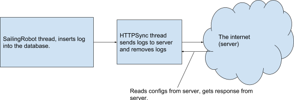

HTTPSYNC DOCS 
=============

The sync reads boat id and password from the database table “server”. Also server URL is read from there. 

Server database table : 

|id   |boat_id |boat_pwd                        |srv_addr                                    |
|-----|--------|--------------------------------|--------------------------------------------|
|1    |ASPire  |Can be found in logininfoPoP    |http://www.sailingrobots.ax/aspire/sync/    |

The table should look something like this to work properly, this setup pushes data towards the live page.

**init** Retrieves server settings from database and initialises curl.

**processMessage** pushes waypoints or configurations on new local changes (Example of cause: xbeeSync functions).

**httpsyncnode_safe_stoi** converts the string sent to it and returns it as a integer.

**HTTPSyncThread** calls all syncing functions while running.

**pushDatalogs** pushes local data to server using curl.

The **HTTPSyncNode::pushWaypoints** function pushes all the current waypoints present in the database up to the server. If no waypoints are added it should work regardless. Waypoints are parsed like Waypoint_1 ,Waypoint_2 at the moment and should probably be changed to how getLogs() parse the json data.

**pushConfigs** pushes configs to the server. The config functionality is not used at the moment but it should be working.
Currently you can only have one config on the boat at the time. Should probably implement some kind of function to read different configs from server.

**getData** is a convenience function that creates a curl call from argument and returns response (json data).

**checkIfNewConfigs** checks if any new configs has been inserted into the DB.

**checkIfNewWaypoints** checks if any new waypoints has been inserted into the DB.

**getConfigsFromServer** updates local configuration data using new server data if any.

**getWaypointsFromServer** updates local waypoints using new server data if any.

**performCURLCall** sends server request in curl format - used for all syncing functionality.

The config table for httpsync : 

|id   |delay |remove_logs |
|-----|------|------------|
|1    |0     |1           |

Delay adds a delay to the thread when it’s pushing logs. It should probably be changed to handle some kind of sending frequency rather than a delay.

The _remove_logs_ flag decides if logs will be removed after they’re pushed. This flag is currently not implemented anywhere due to the fact that _syncServer()_ pushes all logs all the time, so if no logs is removed it will push multiple entries of the same logs and the data size will increase after each _insertDataLog()_ call.

