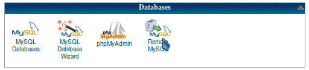

Website on localhost guide
==========================
The goal of this document is to describe the installation of all needed services to run the database on an Arch Linux workstation.
It tries to follow standards as '#' indicating command to be run as root, '$' can be run as user.

## Installation and first time setup

Install and enable apache, mysql (mariadb), PHP and phpMyAdmin

1. Install
    ```console
    # pacman -S apache mariadb php php-fpm phpmyadmin
    ```

2. Set up mariadb
    ```console
    # mysql_install_db --user=mysql --basedir=/usr --datadir=/var/lib/mysql
    ```

   * **Note:** The default database credentials are root without password

3. Edit the PHP configuration file *php.ini*:

    The following lines might already exist and you need to make sure the options are set only once by searching for the options and comment/uncomment where needed.

    */etc/php/php.ini*
    ```sh
    ...
    date.timezone = Europe/Mariehamn
    display_errors = On
    extension=bz2
    extension=mysqli
    extension=pdo_mysql
    ...
    ```

4. Create the httpd configuration file *php-fpm.conf*

    */etc/httpd/conf/extra/php-fpm.conf*
    ```html
    DirectoryIndex index.php index.html
    <FilesMatch \.php$>
        SetHandler "proxy:unix:/run/php-fpm/php-fpm.sock|fcgi://localhost/"
    </FilesMatch>
    ```

5. Create the httpd config file *phpmyadmin.conf*

    */etc/httpd/conf/extra/phpmyadmin.conf*
    ```html
    Alias /phpmyadmin "/usr/share/webapps/phpMyAdmin"
    <Directory "/usr/share/webapps/phpMyAdmin">
        DirectoryIndex index.php
        AllowOverride All
        Options FollowSymlinks
        Require all granted
    </Directory>
    ```

6. Permit empty passwords in phpMyAdmin by editing the file *config.inc.php*

    */etc/webapps/phpmyadmin/config.inc.php*
    ```php
    ...
    $cfg['Servers'][$i]['AllowNoPassword'] = true;
    ...
    ```

7. Edit the webserver configuration *httpd.conf*

    */etc/httpd/conf/httpd.conf*
    ```sh
    ...
    # Load modules for proxy
    LoadModule proxy_module modules/mod_proxy.so
    LoadModule proxy_fcgi_module modules/mod_proxy_fcgi.so
    
    # php-fpm configuration
    Include conf/extra/php-fpm.conf
    
    # phpMyAdmin configuration
    Include conf/extra/phpmyadmin.conf
    ...
    ```

## Starting all services on local machine
Start everything up (it might be overkill to enable all services at startup but the downside is that this step needs to be done every time you need the services locally)

  ```console
  # systemctl start httpd mariadb php-fpm
  ```

*Note:* If you really want to enable automatic startup on boot for the above services: `systemctl start httpd mariadb php-fpm`


## Download the project database

1. Log in at HostGator https://gator3083.hostgator.com:2083/

2. Go to *Databases* and click *phpMyAdmin*

    

3. Export database

  * *Export* -> *Custom*
  * Deselect all database named ithaax_wrdp\*
  * Optional: Select gzip as *Compression* under *Output* for quicker download
  * Under object creation options check:
    * Add CREATE DATABASE / USE statement
    * Add DROP TABLE / VIEW / PROCEDURE / FUNCTION / EVENT / TRIGGER statement
  * Press *Go* and save the SQL-file on your computer


## Import downloaded database to local server

1. Import the database using mysql on the commmandline

  ```console
  $ zcat localhost.sql.gz | mysql -v -u root
  ```

  *Note:* The `mysql -v` option produces lots of verbose output in your terminal. If you want it to stay quiet omit the option.

(if you downloaded as raw text without compression do `mysql -v -u root < localhost.sql` instead)

## Clone website repository and configure it as webserver root

The following assumes you download to your home directory on the workstation. In this case this is */home/sailbot* and cloning the repo will create */home/sailbot/SailingRobotsWebsite*. We also need to change home directory permission so that the webserver have permissions to access the folder.

1. Clone repository and alter home directory permissions

    ```console
    $ cd /home/sailbot
    $ git clone https://github.com/AlandSailingRobots/SailingRobotsWebsite.git
    $ chmod og+x /home/sailbot
    ```

2. Configure server to use repo directory as web rootdir in *httpd.conf* by changing the following lines:

    */etc/httpd/conf/httpd.conf*
    ```
    ...
    DocumentRoot "/home/sailbot/SailingRobotsWebsite"
	<Directory "/home/sailbot/SailingRobotsWebsite">
    ...

    ```

3. Restart the webserver

    ```console
    # systemctl restart httpd
    ```

## References:
  * https://wiki.archlinux.org/index.php/Apache_HTTP_Server
  * https://wiki.archlinux.org/index.php/MySQL
  * https://wiki.archlinux.org/index.php/PHP
  * https://wiki.archlinux.org/index.php/phpMyAdmin

